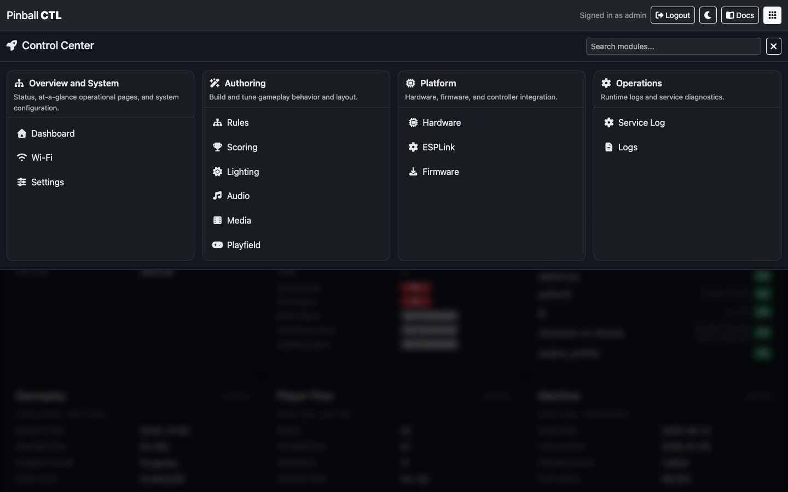

# pinballctl-docs

Documentation repository for the `pinballctl` project.

## Project Repositories

- `pinballctl` = `app`
- `pinballctl-website` = `website`
- `pinballctl-docs` = `docs`

When referring to repos in tasks, the aliases above are the canonical shorthand.

## Source Structure

- Markdown source pages: `pages/`
- Docs assets (screenshots/diagrams): `assets/`
- Build utilities: `utils/`
- Generated static site output: `index.html`, `site-data.json`

`pages/` is the renamed/manual-free source folder for docs content.

## Build (On Demand)

Run this to regenerate the static docs site from markdown:

```bash
./utils/build-docs-site.py
```

What it does:

- parses markdown files in `pages/`
- renders HTML content
- rewrites legacy `/api/manual/assets/...` links to local `./assets/...`
- builds navigation tree + search data in `site-data.json`
- generates `index.html`

## Layout/Design

The docs site uses the same visual base as `website` by syncing `style.css` from `pinballctl-website` during build (when that repo exists beside this one).

Docs-specific layout rules live in `docs.css`.

## Features

- Client-side docs tree navigation
- Client-side search (no backend needed)
- Local bookmarks (stored in browser `localStorage`)
- Click-to-zoom screenshots

## Screenshot Automation Metadata (Draft)

Markdown files can declare screenshot instructions using an inline directive comment or an image `data-source` JSON object:

```md
<!-- pinballctl-shot {"url":"http://raspberrypi.local:8888/login","click":["text=Sign in"],"wait_for":"#dashboard","output":"assets/screenshots/dashboard.png"} -->

```

Validate/inspect directives:

```bash
./utils/build-screenshots.py
```

Defaults:

- Domain: `http://127.0.0.1:8888`
- Username: `admin`
- Password: `password`
- Capture mode: `with_frame=true` (whole browser window/viewport)

Override defaults at runtime:

```bash
./utils/build-screenshots.py --domain http://raspberrypi.local:8888 --username admin --password secret
```

Directive examples:

```md
<!-- pinballctl-shot {"url":"/login","output":"assets/screenshots/login.png"} -->
<!-- pinballctl-shot {"url":"/login","click":[{"action":"type","selector":"input[name='username']","value":"admin"},{"action":"type","selector":"input[name='password']","value":"password"},{"action":"click","selector":"button[type='submit']","wait_for":"[data-menu-toggle]"},{"action":"click","selector":"[data-menu-toggle]","wait_for":"body.flood-open"}],"wait_for":"#flood-menu-body .flood-grid","output":"assets/screenshots/control-center.png"} -->
<!-- pinballctl-shot {"url":"/dashboard","target":"#bridge-status-card","with_frame":false,"output":"assets/screenshots/bridge-card.png"} -->

```

`click` supports string selectors or step objects (`click`, `wait`, `type`).
If `output` is omitted, it is inferred from `img src` (for example `/media/screenshot-login.png` -> `media/screenshot-login.png` and `/api/manual/assets/screenshots/login.png` -> `assets/screenshots/login.png`).
If no `target` is set, the script captures the whole window by default.
Use `dark_mode: true` to emulate dark color scheme. If your UI needs a toggle click as well, set `dark_toggle`.
`login: true` is still supported for compatibility, but explicit `click`/`type` steps are recommended.
