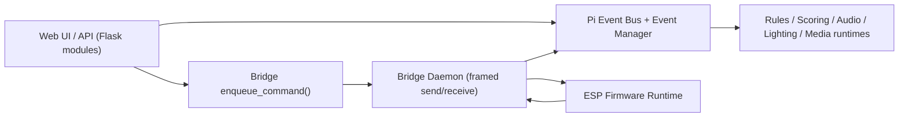

# App Layout

This document maps the `pinballctl` app from two angles:
- physical repository layout
- runtime code paths through app, bridge, events, managers, and firmware

## Physical Layout

In the `pinballctl` app repository:

- `src/pinballctl/app/`
  - Flask app factory (`create_app`) and web bootstrap.
  - Core templates/static and module registration.
- `src/pinballctl/app/modules/*/`
  - Feature modules (dashboard, hardware, rules, lighting, media, audio, events, etc.).
  - Typically expose `bp` (UI blueprint) and `api_bp` (API blueprint).
- `src/pinballctl/bridge/`
  - Serial daemon, framed transport, command queue/RPC sockets, bridge state.
- `src/pinballctl/events/`
  - In-process event bus and event manager routing.
- `src/pinballctl/rules/`, `src/pinballctl/scoring/`, `src/pinballctl/audio/`, `src/pinballctl/lighting/`, `src/pinballctl/media/`
  - Runtime engines/workers and feature logic.
- `src/firmware/`
  - ESP32-S3 firmware source (real-time runtime/safety side).
- `src/instance/`
  - Runtime/generated state and persisted authored data (bridge, hardware, rules, lighting, media, etc.).

## App Bootstrap Path (Pi)

Primary entry points:
- `src/pinballctl/cli.py`
- `src/pinballctl/app/__init__.py` (`create_app`)

`create_app` flow:
1. Binds Flask `instance_path` to `src/instance`.
2. Loads/overlays settings (`src/instance/settings/settings.json`).
3. Registers core + assets blueprints.
4. Auto-discovers and registers module blueprints from `src/pinballctl/app/modules/*`.
5. Starts background workers (currently scoring/audio workers) and media autodisplay startup.

## Module Path Model

Most modules follow this pattern:
- `views.py` for HTML pages under `/<module>`.
- `api.py` for JSON API under `/api/<module>`.
- Optional `init_module(app)` hook for module-specific registration behavior.

Module discovery/registration is centralized in `src/pinballctl/app/__init__.py`.

## Bridge Path Model (Pi <-> ESP)

Main files:
- `src/pinballctl/bridge/daemon.py`
- `src/pinballctl/bridge/state.py`

Command flow:
1. Pi code enqueues commands via `enqueue_command()`/`enqueue_commands()`.
2. Bridge consumes queued commands from socket/RPC queue.
3. `_send_cmd()` serializes compact JSON and sends framed bytes over serial.

Bridge state/artifacts (under `src/instance/bridge/`):
- `bridge_state.json`
- `bridge_commands.json` (fallback path)
- `bridge_responses.json`
- `bridge_cmd.sock`
- `bridge_rpc.sock`

## Event Path Model (Pi)

Main files:
- `src/pinballctl/events/bus.py`
- `src/pinballctl/events/manager.py`
- `src/pinballctl/app/modules/events/api.py`
- `src/pinballctl/bridge/daemon.py`

Ingress sources:
- API event fire endpoint (`/api/events/fire`).
- Bridge RX for ESP-origin event payloads.

Processing shape:
1. Event becomes a normalized envelope/context.
2. Published to in-process event bus.
3. Dispatched by event manager using route keys (`all`, `event:*`, `system:*`, `hardware:*`, `custom`).
4. Downstream runtimes (rules/scoring/audio/etc.) consume according to module logic.

## Manager/Worker Roles

Current manager/worker roles include:
- Event manager (`events/manager.py`): route registry + dispatch.
- Scoring worker (`scoring/runtime.py`): background bus processing.
- Audio worker (`audio/runtime.py`): background bus processing.
- Bridge daemon (`bridge/daemon.py`): transport boundary and message routing.

## Firmware Boundary (ESP)

Main file:
- `src/firmware/src/System.cpp`

Firmware runtime responsibilities:
- Reads framed serial input in a non-blocking loop.
- Validates frame length and dispatches payloads to protocol handler.
- Maintains runtime safety and hardware-side execution behavior.

Transport rule:
- Frames-only JSON (length-prefixed), no newline command path.

## End-to-End Path (High Level)

